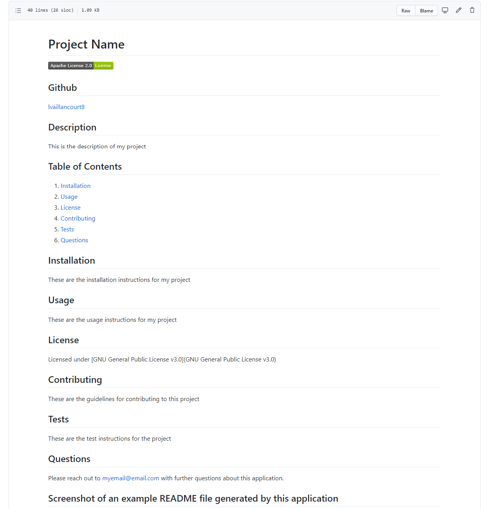

# Project Name

 

## Github
[lvaillancourt8](https://github.com/lvaillancourt8/)

## Description
This is a description of my project

## Table of Contents

1. [Installation](#installation)
2. [Usage](#usage)
3. [License](#license)
4. [Contributing](#contributing)
5. [Tests](#tests)
6. [Questions](#tests)

## Installation 
These are the installation instructions for my project

## Usage 
These are the usage instructions for my project

## License 
Licensed under [GNU General Public License v3.0](https://www.gnu.org/licenses/gpl-3.0.en.html) License

## Contributing 
These are the contribution guidelines for my project

## Tests 
These are the test instructions for my project

## Questions 
Please reach out to myemail@email.com with further questions about this application.

## Screenshot of an example README file generated by this application
